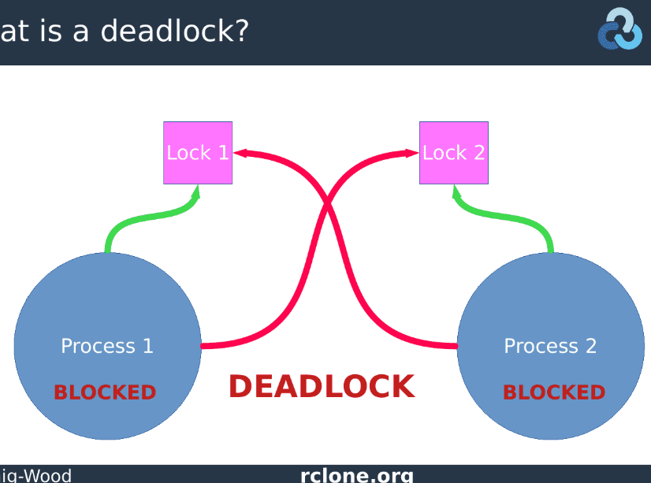

# Deadlock prevent
https://medium.com/@ksandeeptech07/handling-deadlocks-in-golang-gracefully-1f661c341a1d
## 1. Avoid nested lock
Just one lock a times we are surely they not deadlock
## 2. Lock ordering

